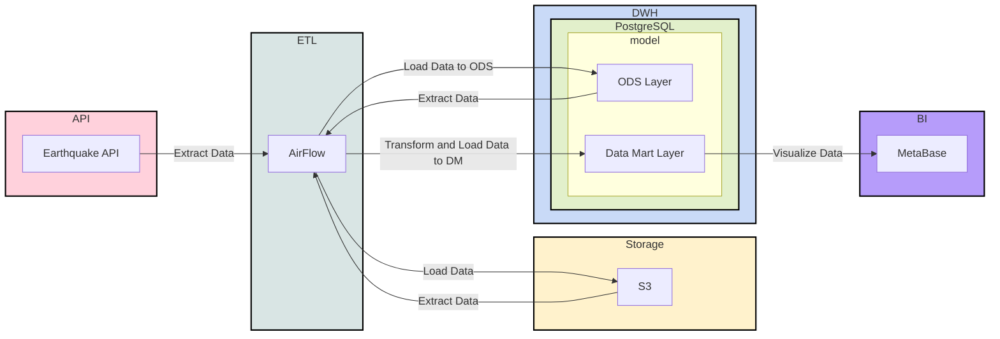

# 🌍 Earthquake Data Platform (Pet Project)

Пет-проект для дата-инженера: от получения данных из публичного API до витрин и визуализации в BI.

Проект демонстрирует базовые принципы Data Engineering, Lakehouse-архитектуры и Data Governance на реальном датасете землетрясений (USGS).

---

## 🧠 Идея проекта

Источник данных — публичный **USGS Earthquake API**.  
Данные извлекаются с помощью Airflow, сохраняются в Data Lake, агрегируются в DWH и визуализируются в BI-системе.

Проект учебный, не production-ready, но отражает end-to-end пайплайн дата-инженера.

---

## Создание виртуального окружения

```bash
python3.12 -m venv venv && \
source venv/bin/activate && \
pip install --upgrade pip && \
pip install -r requirements.txt
```

## Разворачивание инфраструктуры

```bash
docker-compose up -d
```

## Ссылки

- [Описание работы API](https://earthquake.usgs.gov/fdsnws/event/1/#methods)
- [Описание полей из API](https://earthquake.usgs.gov/data/comcat/index.php)
- [airflow docker-compose](https://airflow.apache.org/docs/apache-airflow/2.10.5/docker-compose.yaml)

## Data Governance


### 1. Data Architecture

Lakehouse



### 2. Data Modeling & Design

AS IS модель

Без звезды и снежинки

Историчность не требуется

### 3. Data Storage & Operations

#### Storage

Cold, Warm Storage – S3
Hot Storage – PostgreSQL

#### Compute/Operations

DuckDB – Data Lake
PostgreSQL – DM layer

### 4. Data Security

Роли и пользователи PostgreSQL

Права доступа в S3

Роли Airflow

Возможна интеграция с LDAP

### 5. Data Integration & Interoperability (Интеграция данных и совместимость)

Типизация данных в ODS слое не реализована, но необходима для production:

К примеру, сейчас:

```sql
...
time varchar
...
```

А нужно:

```sql
...
time timestamp
...
```

### 6. Documents & Content

README + комментарии к коду 

### 7. Reference & Master Data

Data Lake содержит “золотые” данные

Данные не модифицируются

### 8. Data Warehousing & Business Intelligence

PostgreSQL — горячее хранилище

BI — Metabase

Рекомендации:

TTL для витрин

Ролевая модель

Автообновление

Минимум ручного труда

### 9. Meta-data

Сейчас мета-данных нет, но их можно задать к примеру через комментарии к столбцам в DWH
Возможные инструменты: DataHub, OpenMetadata

### 10. Data Quality

Не реализовано.

Минимальный набор:

Проверка доставки данных

SLA

Алерты

Сравнение с источником

## Notes

SQL схемы:

```sql
CREATE SCHEMA ods;
CREATE SCHEMA dm;
CREATE SCHEMA stg;
```

DDL `ods.fct_earthquake`:
```sql
CREATE TABLE ods.fct_earthquake
(
	time varchar,
	latitude varchar,
	longitude varchar,
	depth varchar,
	mag varchar,
	mag_type varchar,
	nst varchar,
	gap varchar,
	dmin varchar,
	rms varchar,
	net varchar,
	id varchar,
	updated varchar,
	place varchar,
	type varchar,
	horizontal_error varchar,
	depth_error varchar,
	mag_error varchar,
	mag_nst varchar,
	status varchar,
	location_source varchar,
	mag_source varchar
)
```

DDL `dm.fct_count_day_earthquake`:

```sql
CREATE TABLE dm.fct_count_day_earthquake AS 
SELECT time::date AS date, count(*)
FROM ods.fct_earthquake
GROUP BY 1
```

DDL `dm.fct_avg_day_earthquake`:

```sql
CREATE TABLE dm.fct_avg_day_earthquake AS
SELECT time::date AS date, avg(mag::float)
FROM ods.fct_earthquake
GROUP BY 1 
```